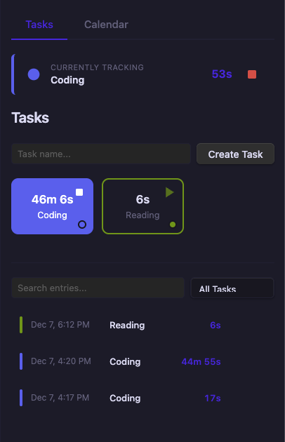
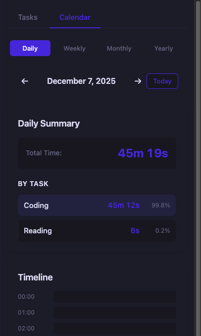
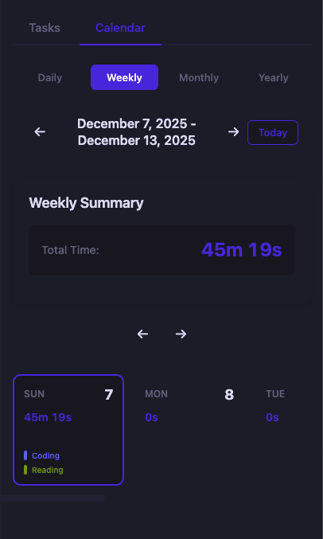
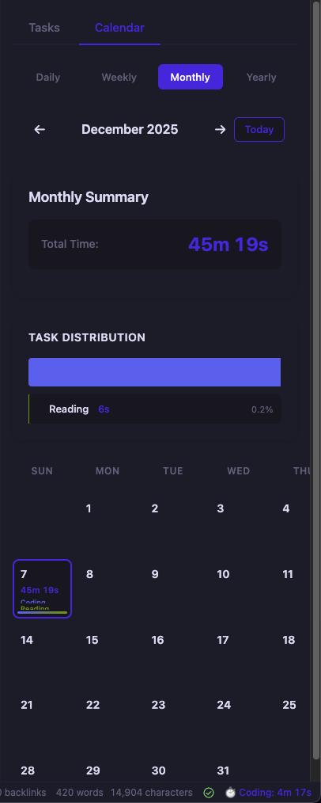

# ⏰ Time Punch Clock

> Track your time with a simple punch in/out system. Multiple tasks, beautiful calendars, full history.

  

## Features

- **Multi-task tracking** — Punch into multiple tasks at once
- **Real-time timers** — Live countdown for active sessions
- **Calendar views** — Daily, weekly, monthly, yearly
- **Color-coded tasks** — Custom colors for visual organization
- **Search & filter** — Find any time entry instantly
- **Edit history** — Modify or delete past entries
- **Local storage** — All data stays in your vault

## Quick Start

1. Click the **clock icon** in the left ribbon
2. Type a task name → **Create Task**
3. Click a task card to **punch in**
4. Click again to **punch out**

## Calendar Views

  
  
  

| View | What it shows |
|------|---------------|
| **Daily** | Hourly timeline + task breakdown |
| **Weekly** | 7-day grid with time per day |
| **Monthly** | Full calendar with daily totals |
| **Yearly** | 12-month overview + trends |

## Commands

| Command | Action |
|---------|--------|
| `Open Time Punch Clock Panel` | Open the main view |
| `Quick Punch In/Out` | Toggle last used task |

## Data & Privacy

All data is stored locally in your vault as JSON. No cloud sync, no external servers.

## License

MIT — Free to use, modify, and distribute.

---

Built for the Obsidian community ❤️
